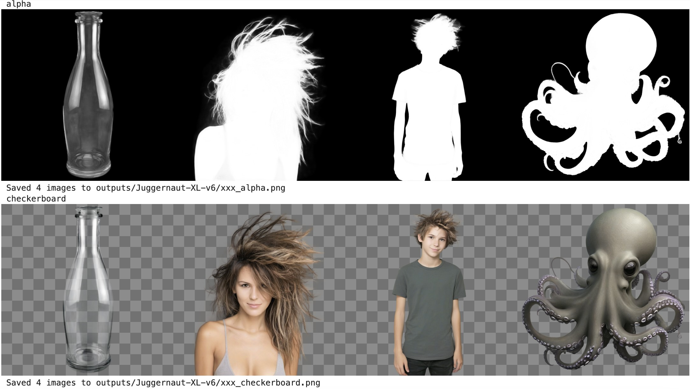

# Diffuser-layerdiffuse


_4 example of output images with model `"Juggernaut-XL-v9"`_ 

- Unofficial implementation of layerdiffuse with diffusers: https://github.com/layerdiffusion/LayerDiffuse
- Paper: https://arxiv.org/abs/2402.17113
- This leverages some work done by other people:
  - https://github.com/KaustubhPatange/Diffuser-layerdiffuse
  - https://github.com/huchenlei/ComfyUI-layerdiffuse/tree/main

## How to install
Install package
```bash
pip install -e .
```

Note: `xformers` library is optional

## How to use it

```python
from layer_diffusers.transparency_manager import TransparencyManager

# instantiate the transparency manager
transparency_manager = TransparencyManager(pipe)
transparency_manager.patch_pipe()

# run any pipe you like
images = pipe(prompt=prompt, negative_prompt="bad, ugly", num_inference_steps=20,
                  width=1024, height=1024, generator=gen).images
    
# this should be run right after the forward pass of the pipe, as it operates on the latest latent
pixels, pixels_rgb, alpha, checkerboard_image = transparency_manager.post_process_transparency()
```

and have a look at the notebook `demo.ipynb` or the python script `demo.py`